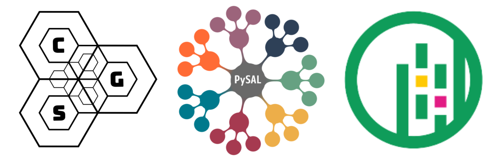

# pysal-iale2022

[](https://mybinder.org/v2/gh/knaaptime/pysal-iale2022/main?urlpath=lab)

[Access Jupyterhub](http://192.155.82.212)

workshop on the spatial analysis of inequality using pysal and geosnap, delivered at IALE 2022

<p align="center">

</p>

### Instructors

* sergio rey - Center for Geospatial Sciences @ UCR
* eli knaap - Center for Geospatial Sciences @ UCR

---

## Schedule

### Part 1

1. First Section
 + spatial data processing, 
 + construction of spatial graphs and networks; 

2. Second section

   + global and local spatial autocorrelation analysis

### Break

### Part 2

3. Third Section

 + neighborhood delineation and analysis; 
 + neighborhood dynamics

4. Fourth Section

   + segregation analysis
   + segregation dynamics

---


## Getting Started

**To get started immediately without installing or downloading anything, click the *"Launch Binder"* button at the top of this page**


If you are familiar with GitHub, you should clone or fork this GitHub repository to a specific directory. Cloning can be done by:

``` bash
git clone https://github.com/knaaptime/pysal-iale2022.git
```

If you are not using git, you can grab the workshop materials as a zip file by pointing your browser to (https://github.com/knaaptime/pysal-iale2022.git) and clicking on the green _Clone or download_ button in the upper right.


Extract the downloaded zip file to a working directory.

